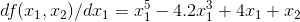
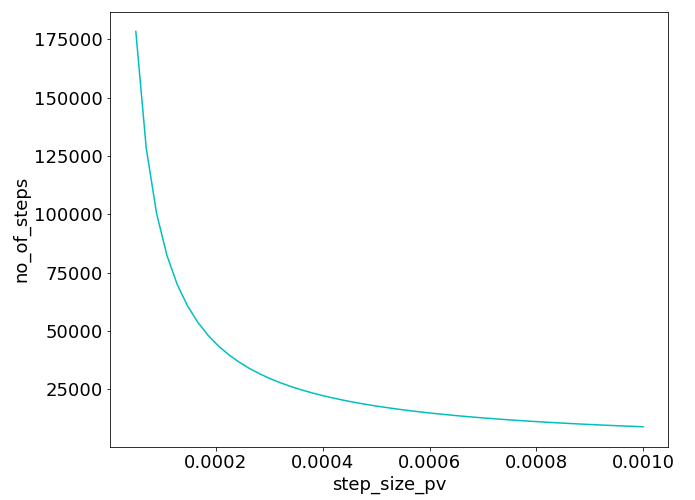
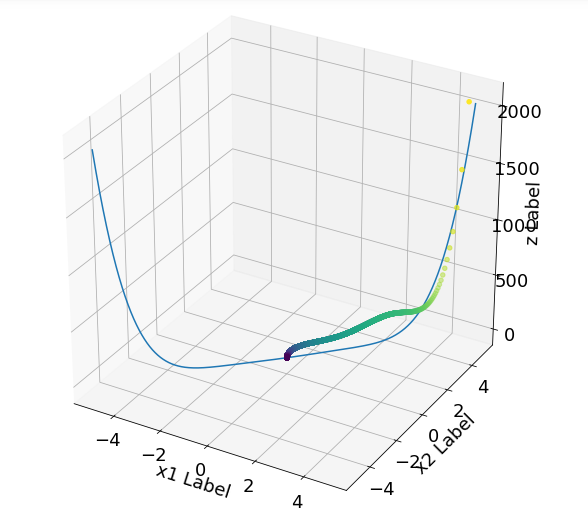
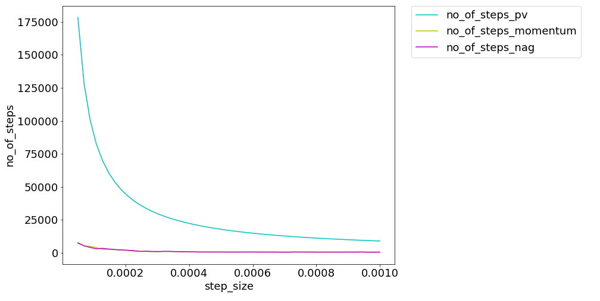
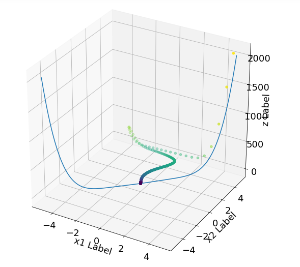
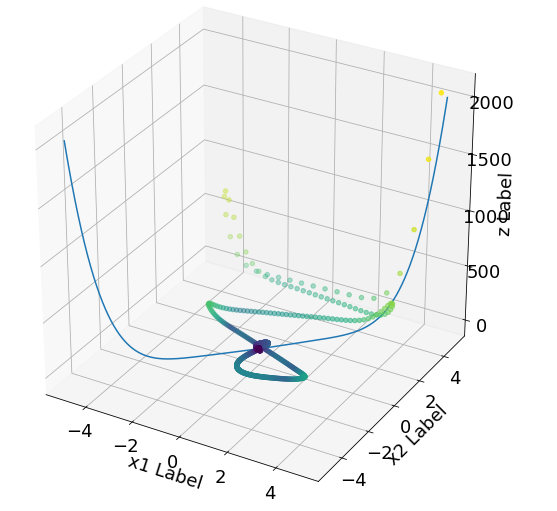

# AML2019Group14
This repository includes code, text and graphical output to demonstrate and showcase understanding of gradient descent.  The calculations are implemented in a Python class.

**Why is gradient descent important in machine learning?**  
Gradient descent (GD) 'informs' the machine of the direction and distance to move as it seeks to find a function's minimum value. It is therefore important in machine learning as it enables relatively quick optimisation of functions that describe various phenomena (either theoretical or real world). 

**How does plain vanilla gradient descent work?**  
Plain vanilla GD works by minimising the function based on a learning rate and the slope of the function. On computing the slope, the independent variables in the function are adjusted in the opposite direction as the gradient (hence gradient 'descent'). The adjustment is computed as the learning rate (set at the start) multiplied by the slope. It is therefore important to select an appropriate learning rate, otherwise the minimum obtained may not be close to the true minimum of the function.

**Two modifications to plain vanilla gradient descent.**  
Includes GD with Momentum and Nesterov Accelerated Gradient (NAG), among others.

*GD with Momentum*

This takes the direction of the previous steps into account and thus accelerates and smoothens the process of finding a minimum. It therefore dempens the oscillations of plain vanila GD and avoids getting stuck at saddle points.

*Nesterov Accelerated Gradient (NAG)*

NAG provides further improvement on GD with Momentum. It takes further account of the velocity of the GD process and further avoids oscillation, especially when the learning rate selected is high. It does this by 'peeking' ahead and slowing down if the gradient is getting much flatter or if it reverses direction.

**GD Illustrations:**

We will demonstrate the above variants of GD by attempting to minimise the Three-Hump Camel function.

This function is as follows:

.gif)

While the partial derivatives are as follows:

Plotting the function produces the following graphical illustration:

_graph.png)

From the above graph, it can be seen that the function has multiple minima and it is thus non-trivial.

We opted to set the tolerance at 1e-11, initial x_1 and x_2 at 5 , number of iterations at 200,000 step size at 1e-4, tolerance at 1e-11 and alpha at 0.95 for both Momentum and NAG.

*1. Plain Vanilla GD*

For plain vanilla GD, we carried out an analysis of how number of steps to convergence varies with step size. The graph below illustrates our findings.

The above graph shows that as step size increases, the number of steps to convergence also increases. On carrying out a brute force search of the minimum, we determined that the minimum loss is 1.047e-20 which occurs at min x_1 = 5.116e-11 and min x_2 =  5.116e-11.

With the smallest step size considered (5*1e-5), the minimum loss derived was 3.152e-12 while with the largest step size (1e-3), the minimum loss derived was 3.142e-12. This does not reflect the global minimum and thus plain vanilla GD may not be the ideal method of obtaining the global minimum.

The graphic below illustrates the path followed by gradient descent (based on a step size of 1e-4).

It can be seen that the GD path follows a single trajectory before arriving at a minimum. Since this is a 3 dimensional function, it makes it more difficult to find minimas present on other planes of the function. Also, on arriving at one of the proximate mimimas, the process breaks. These problems can be solved by Momentum or NAG.

*2. Comparison of Plain Vanilla GD with Momentum and NAG* 

The graph below compares the performance of the 3 variants of GD being considered.

From the above, it can be seen that plain vanilla GD requires a significantly higher number of steps to convergence as compared to Momentum and NAG. For example for step size = 5*1e-5, plain vanilla GD required 178,330 steps while Momentum required	7,430 steps and NAG required 7,448 steps. This trend is consistent as the step size increases.

On setting the step size to 1e-4 and alpha = 0.95, the path of the gradient descent for Momentum is as shown below.

By following a path along both independent axes, this method improves the chances of finding a global minimum. The miminum derived in this case is 3.140e-12, which is marginally lower than the corresponding minimum of 3.151e-12 obtained through plain vanilla GD.

NAG however did not lead to desirable results as a minimum of 0.298 was obtained using the same paramaters as Momentum above. By setting alpha to 0.99, the minimum obtained by NAG was 1.411e-12, which is a better result than both plain vanilla GD and Momentum. A graph illustrating the path taken by NAG is provided below.

Momentum and NAG therefore provide acceptable results with fewer steps. Based on this, these two variants may provide a better alternative relative to plain vanilla GD. Also, by taking into account previous steps, haphazard oscilation of the GD is avoided thus reducing chances of divergence.
