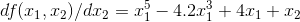

# AML2019Group14
This repository includes code, text and graphical output to demonstrate and showcase understanding of gradient descent.  The calculations are implemented in a Python class.

**Why is gradient descent important in machine learning?**  
Gradient descent (GD) 'informs' the machine of the direction and distance to move as it seeks to find a function's minimum value. It is therefore important in machine learning as it enables relatively quick optimisation of functions that describe various phenomena (either theoretical or real world). 

**How does plain vanilla gradient descent work?**  
Plain vanilla GD works by minimising the function based on a learning rate and the slope of the function. On computing the slope, the independent variables in the function are adjusted in the opposite direction as the gradient (hence gradient 'descent'). The adjustment is computed as the learning rate (set at the start) multiplied by the slope. It is therefore important to select an appropriate learning rate, otherwise the minimum obtained may not be close to the true minimum of the function.

**Two modifications to plain vanilla gradient descent.**  
Includes GD with Momentum and Nesterov Accelerated Gradient (NAG), among others.

*GD with Momentum*

This takes the direction of the previous steps into account and thus accelerates and smoothens the process of finding a minimum. It therefore dempens the oscillations of plain vanila GD and avoids getting stuck at saddle points.

*Nesterov Accelerated Gradient (NAG)*

NAG provides further improvement on GD with Momentum. It takes further account of the velocity of the GD process and further avoids oscillation, especially when the learning rate selected is high. It does this by 'peeking' ahead and slowing down if the gradient is getting much flatter or if it reverses direction.

**GD Illustrations:**

We will demonstrate the above variants of GD by attempting to minimise the Three-Hump Camel function.

This function is as follows:

.gif)

While the partial derivatives are as follows:

*1. Plain Vanilla GD*

*2. GD with Momentum*

*3. Nesterov Accelerated Gradient (NAG)*

